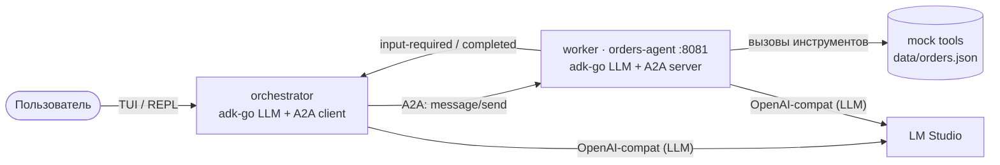

# A2A Orders Assistant — Go Demo

A minimal, self-contained demo of the **Agent-to-Agent (A2A) protocol** using two
Go agents. The orchestrator talks to the user through a terminal REPL; the worker
handles order-management tasks via mock tools. The demo highlights four things:

1. **Agent delegation over A2A** — the orchestrator treats the remote worker as an
   `ask_orders_agent` tool backed by a live JSON-RPC / SSE channel.
2. **Tool calls** — the worker invokes mock order-system tools (`find_order`,
   `initiate_refund`, …) powered by an in-memory store seeded from `data/orders.json`.
3. **User clarification via `input-required`** — when the worker needs more information
   it suspends the A2A task with the canonical `input-required` status; the orchestrator
   relays the question to the user, collects the answer, and resumes the **same** task
   so the worker can complete the refund.
4. **Human-in-the-Loop refund confirmation** — `initiate_refund` never fires blindly:
   it pauses the A2A task in `input-required` asking the user to confirm, the
   orchestrator relays that yes/no question, and the refund executes only once the
   user replies with an explicit "да".

Both agents use a local LLM served by [LM Studio](https://lmstudio.ai/) (OpenAI-compatible
API).

---

## Architecture



> LM Studio endpoint: `http://localhost:1234/v1` locally, or
> `http://host.docker.internal:1234/v1` from Docker (see the WSL2 note below).

The orchestrator is an `adk-go` `LlmAgent` with one custom tool `ask_orders_agent`.
That tool holds an `a2aclient.Client` pointing at the worker and stores any pending
`taskId`/`contextId` so it can resume the same task after the user provides
clarification. The tool's name and description are not hardcoded — they are
**derived from the worker's AgentCard** at startup, fetched via A2A capability
discovery (`GET /.well-known/agent-card.json`), so the orchestrator adapts to
whatever the worker advertises.

The worker runs an `a2aproject/a2a-go` HTTP server. Its `AgentExecutor` wraps an
`adk-go` `LlmAgent` that has the five order tools registered. The AgentCard is
served at `/.well-known/agent-card.json` and advertises the `/invoke` JSON-RPC
endpoint.

---

## Prerequisites

| Requirement | Notes |
|---|---|
| **Go 1.26.2+** | Must satisfy the `go 1.26.2` directive in `go.mod` |
| **LM Studio** | Download from [lmstudio.ai](https://lmstudio.ai/) |
| **Tool-capable model** | Load a model that supports function/tool calling (e.g. `qwen2.5-7b-instruct`, `mistral-nemo-instruct-2407`) |
| **LM Studio server** | Start the local server on port **1234** (default) |
| **Docker + Compose** | Only required for the Docker workflow |

> The test suite (`go test ./...`) runs without LM Studio — it uses a deterministic
> stub LLM and exercises the full A2A round-trip in-process.

---

## Running locally

Open two terminals in the project root.

**Terminal 1 — start the worker (A2A server)**

```bash
go run ./cmd/worker
# Listening on :8081, AgentCard at http://localhost:8081/.well-known/agent-card.json
```

**Terminal 2 — start the orchestrator (TUI)**

```bash
go run ./cmd/orchestrator
# > (prompt appears, type your message and press Enter)
```

Configuration lives in `configs/worker.yaml` and `configs/orchestrator.yaml`.
Override any value with environment variables:

| Variable | Default (yaml) | Purpose |
|---|---|---|
| `WORKER_LISTEN_ADDR` | `:8081` | Worker HTTP listen address |
| `WORKER_PUBLIC_URL` | `http://localhost:8081` | URL advertised in the AgentCard |
| `WORKER_URL` | `http://localhost:8081` | Orchestrator → worker A2A base URL |
| `LLM_BASE_URL` | `http://localhost:1234/v1` | OpenAI-compatible LLM endpoint |
| `LLM_MODEL` | `local-model` | Model name passed to LM Studio |
| `LLM_API_KEY` | `lm-studio` | API key (any non-empty string works) |
| `WORKER_DATA_PATH` | `data/orders.json` | Path to the seed orders file |

> **WSL2 + LM Studio on Windows.** If you run the agents inside WSL2 while LM Studio
> runs on the Windows host, `http://localhost:1234` usually does **not** reach it
> (NAT networking, and the Hyper-V firewall blocks WSL→Windows loopback). Fix:
> 1. In LM Studio enable **"Serve on Local Network"** so it binds `0.0.0.0:1234`.
> 2. Point the agents at the Windows host's LAN IP, e.g.:
>    ```bash
>    export LLM_BASE_URL=http://192.168.1.53:1234/v1   # your Windows host IP
>    export LLM_MODEL=openai/gpt-oss-20b               # a tool-capable model
>    ```
>    Find the address LM Studio reports in its Developer / Local Server tab. Verify
>    from WSL2 with `curl $LLM_BASE_URL/models` before starting the agents.

---

## Running via Docker Compose

```bash
# Build images and start the worker in the background.
docker compose up worker -d

# Start the orchestrator interactively (attaches a terminal for the TUI).
docker compose run --rm orchestrator
```

LM Studio must be running on the host. The containers reach it via
`http://host.docker.internal:1234/v1` (the `extra_hosts` setting maps this to the
host gateway on Linux).

To stop the worker afterwards:

```bash
docker compose down
```

---

## Walkthrough: refund with clarification

This scenario exercises all three A2A features at once.

```
> I'd like a refund on my last order
```

1. **Orchestrator LLM** decides to delegate and calls the `ask_orders_agent` tool,
   sending an A2A `SendMessage` to the worker.

2. **Worker LLM** calls `list_recent_orders`, finds two candidates (`#1023` and
   `#1041`), and cannot decide which one to refund. It returns the A2A task in
   **`input-required`** status with the message:
   *"I found orders #1023 (headphones) and #1041 (keyboard). Which one should I
   refund?"*

3. **Orchestrator** receives `input-required`, saves the `taskId` + `contextId`,
   and prints the worker's question to the TUI:

   ```
   [worker needs more info] I found orders #1023 and #1041. Which one?
   ```

4. User types the clarification:

   ```
   > #1041
   ```

5. **Orchestrator** resumes the **same** A2A task (same `taskId`/`contextId`) by
   sending the user's answer as a new message. This is the key A2A feature: the
   worker does not start over; it continues where it left off.

6. **Worker LLM** calls `initiate_refund("1041")`. The tool marks the order
   refunded and returns a success result. The A2A task transitions to `completed`.

7. **Orchestrator LLM** formats the final confirmation and prints it to the TUI:

   ```
   Refund for order #1041 has been initiated. You should receive a confirmation
   email within 24 hours.
   ```

The `input-required` state and task resumption are the A2A protocol in action —
contrast this with a naive HTTP call that would lose all context between turns.

---

## Tests

Run the full suite without LM Studio (uses an in-process stub LLM):

```bash
go test ./...
```

Tests cover:
- All five order tools, including error branches (`internal/orders`)
- Config loading and env overrides (`internal/config`)
- A2A server integration: full `SendMessage` → `input-required` → resume → `completed`
  round-trip in-process (`internal/a2abridge`)

---

## Project layout

```
cmd/
  orchestrator/   # TUI entry point
  worker/         # A2A server entry point
internal/
  a2abridge/      # adk-go ↔ a2a-go wiring, AgentExecutor
  orders/         # mock domain, tools, seed loader
  agent/          # LlmAgent builder (adk-go + OpenAI-compat model)
  tui/            # minimal line-oriented REPL
  config/         # YAML loader + env overrides
configs/
  orchestrator.yaml
  worker.yaml
data/
  orders.json     # seed data
Dockerfile
docker-compose.yml
```
