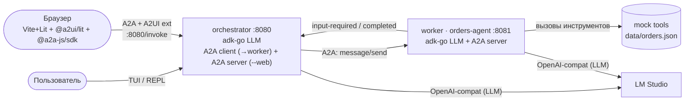

# A2A Orders Assistant — Go Demo

A minimal, self-contained demo of the **Agent-to-Agent (A2A) protocol** using two
Go agents, with an optional browser front-end that renders the conversation as
rich UI via the **A2UI** extension. The orchestrator talks to the user either
through a terminal REPL or a browser tab; the worker handles order-management
tasks via mock tools. The demo highlights five things:

1. **Agent delegation over A2A** — the orchestrator treats the remote worker as an
   `ask_orders_agent` tool backed by a live JSON-RPC / SSE channel.
2. **Tool calls** — the worker invokes mock order-system tools (`find_order`,
   `initiate_refund`, …) powered by an in-memory store seeded from `data/orders.json`.
3. **User clarification via `input-required`** — when the worker needs more information
   it suspends the A2A task with the canonical `input-required` status; the orchestrator
   relays the question to the user, collects the answer, and resumes the **same** task
   so the worker can complete the refund.
4. **Human-in-the-Loop refund confirmation** — `initiate_refund` never fires blindly:
   it pauses the A2A task in `input-required` asking the user to confirm, the
   orchestrator relays that yes/no question, and the refund executes only once the
   user replies with an explicit "да" (in the terminal) or a button click (in the browser).
5. **A2UI in the browser** — with `--web`, the orchestrator itself becomes an A2A
   server and an **A2UI gateway**: it maps the worker's domain data into A2UI
   widgets (order card, order list, confirmation) that the browser renders with
   the official `@a2ui/lit` renderer. See [Web UI (A2UI)](#web-ui-a2ui) below.

Both agents use a local LLM served by [LM Studio](https://lmstudio.ai/) (OpenAI-compatible
API).

---

## Architecture



> LM Studio endpoint: `http://localhost:1234/v1` locally, or
> `http://host.docker.internal:1234/v1` from Docker (see the WSL2 note below).

The orchestrator is an `adk-go` `LlmAgent` with one custom tool `ask_orders_agent`.
That tool holds an `a2aclient.Client` pointing at the worker and stores any pending
`taskId`/`contextId` so it can resume the same task after the user provides
clarification. The tool's name and description are not hardcoded — they are
**derived from the worker's AgentCard** at startup, fetched via A2A capability
discovery (`GET /.well-known/agent-card.json`), so the orchestrator adapts to
whatever the worker advertises.

The worker runs an `a2aproject/a2a-go` HTTP server. Its `AgentExecutor` wraps an
`adk-go` `LlmAgent` that has the five order tools registered. The AgentCard is
served at `/.well-known/agent-card.json` and advertises the `/invoke` JSON-RPC
endpoint. The worker is unaware of A2UI or the browser — it only ever talks A2A
to the orchestrator, exactly as in the terminal-only setup.

With `--web`, the orchestrator additionally runs an `a2asrv` A2A **server** on
`:8080` (its own `/invoke` and AgentCard), so it is simultaneously an A2A
**client** to the worker and an A2A **server** to the browser. Its AgentCard
advertises the [A2UI](https://a2ui.org/) extension
(`https://a2ui.org/a2a-extension/a2ui/v0.9`) via `A2A-Extensions`. When the
browser negotiates that extension, the orchestrator acts as an **A2UI gateway**:
it translates the worker's plain order data/widgets into A2UI JSON (`DataPart`s
with MIME `application/a2ui+json`) instead of plain text, so the browser can
render an order card, an order list, or an interactive refund confirmation.

---

## Prerequisites

| Requirement | Notes |
|---|---|
| **Go 1.26.2+** | Must satisfy the `go 1.26.2` directive in `go.mod` |
| **LM Studio** | Download from [lmstudio.ai](https://lmstudio.ai/) |
| **Tool-capable model** | Load a model that supports function/tool calling (e.g. `qwen2.5-7b-instruct`, `mistral-nemo-instruct-2407`) |
| **LM Studio server** | Start the local server on port **1234** (default) |
| **Docker + Compose** | Only required for the Docker workflow |
| **Node.js + yarn** | Only required to (re)build the [Web UI](#web-ui-a2ui) frontend — the built assets are committed, so running the demo does not require Node |

> The test suite (`go test ./...`) runs without LM Studio — it uses a deterministic
> stub LLM and exercises the full A2A round-trip in-process.

---

## Running locally

**First-time setup — create your configs.** The real `configs/worker.yaml` and
`configs/orchestrator.yaml` are **gitignored** (they hold your LLM endpoint and
API key), so create them from the committed templates before the first run:

```bash
cp configs/worker.example.yaml       configs/worker.yaml
cp configs/orchestrator.example.yaml configs/orchestrator.yaml
```

Then open **each** file and fill in the `llm:` block — that is where the LLM
connection goes:

```yaml
llm:
  base_url: "http://localhost:1234/v1"   # OpenAI-compatible endpoint
  model:    "your-model-name"            # exact model id the endpoint serves
  api_key:  "your-api-key"               # any non-empty string for LM Studio
```

- **LM Studio (local):** `base_url: http://localhost:1234/v1`, `api_key: lm-studio`.
- **Remote provider:** `base_url: https://api.your-provider.com/v1` plus your real key.

Both files use the same `llm:` block. Any value can also be set via env vars
(see the table below) — handy for keeping the key out of the file entirely.

---

Then open two terminals in the project root.

**Terminal 1 — start the worker (A2A server)**

```bash
go run ./cmd/worker
# Listening on :8081, AgentCard at http://localhost:8081/.well-known/agent-card.json
```

**Terminal 2 — start the orchestrator (TUI)**

```bash
go run ./cmd/orchestrator
# > (prompt appears, type your message and press Enter)
```

**Environment overrides.** Any config value can also be overridden with an
environment variable (handy for CI or for keeping the key out of files entirely):

| Variable | Default (yaml) | Purpose |
|---|---|---|
| `WORKER_LISTEN_ADDR` | `:8081` | Worker HTTP listen address |
| `WORKER_PUBLIC_URL` | `http://localhost:8081` | URL advertised in the AgentCard |
| `WORKER_URL` | `http://localhost:8081` | Orchestrator → worker A2A base URL |
| `LLM_BASE_URL` | `http://localhost:1234/v1` | OpenAI-compatible LLM endpoint |
| `LLM_MODEL` | `local-model` | Model name passed to LM Studio |
| `LLM_API_KEY` | `lm-studio` | API key (any non-empty string works) |
| `WORKER_DATA_PATH` | `data/orders.json` | Path to the seed orders file |

> **WSL2 + LM Studio on Windows.** If you run the agents inside WSL2 while LM Studio
> runs on the Windows host, `http://localhost:1234` usually does **not** reach it
> (NAT networking, and the Hyper-V firewall blocks WSL→Windows loopback). Fix:
> 1. In LM Studio enable **"Serve on Local Network"** so it binds `0.0.0.0:1234`.
> 2. Point the agents at the Windows host's LAN IP, e.g.:
>    ```bash
>    export LLM_BASE_URL=http://192.168.1.53:1234/v1   # your Windows host IP
>    export LLM_MODEL=openai/gpt-oss-20b               # a tool-capable model
>    ```
>    Find the address LM Studio reports in its Developer / Local Server tab. Verify
>    from WSL2 with `curl $LLM_BASE_URL/models` before starting the agents.

---

## Running via Docker Compose

```bash
# Build images and start the worker in the background.
docker compose up worker -d

# Start the orchestrator interactively (attaches a terminal for the TUI).
docker compose run --rm orchestrator
```

LM Studio must be running on the host. The containers reach it via
`http://host.docker.internal:1234/v1` (the `extra_hosts` setting maps this to the
host gateway on Linux).

To stop the worker afterwards:

```bash
docker compose down
```

---

## Web UI (A2UI)

Instead of the terminal REPL, the orchestrator can serve a browser UI that
renders the same conversation as interactive widgets (order card, order list,
refund confirmation) using the official [A2UI](https://a2ui.org/) renderer.
A2UI is carried as a standard **A2A extension**: the browser negotiates it via
`A2A-Extensions`, and UI payloads travel as ordinary A2A `DataPart`s (MIME
`application/a2ui+json`) alongside the normal task/message flow — no separate
protocol or connection.

> **A2A protocol version.** The Go server (`a2a-go v2.3.x`) speaks **A2A 1.0**
> (AgentCard with `supportedInterfaces` / `protocolBinding`, proto-oneof parts).
> The browser must speak the same revision, so the frontend pins
> **`@a2a-js/sdk@1.0.0-beta.0`** (npm dist-tag `next`) — the `latest` `0.3.x`
> line still implements the older A2A `v0.x` card/message schema and cannot
> negotiate a transport from a 1.0 AgentCard. If you bump this dependency, keep
> it on an A2A-1.0 release.

**1. Build the frontend** (Node.js only needed for this step; the built assets
are committed to the repo, so a fresh checkout can skip this if `internal/webui/dist`
is already present):

```bash
cd web
yarn install
yarn build
# emits internal/webui/dist, embedded into the orchestrator binary via go:embed
```

**2. Start LM Studio** as in [Running locally](#running-locally) above.

**3. Start the worker** (unchanged):

```bash
go run ./cmd/worker
```

**4. Start the orchestrator in web mode** (requires the worker already reachable
at `WORKER_URL`, default `http://localhost:8081`):

```bash
go run ./cmd/orchestrator --web
# orchestrator web UI on :8080
```

**5. Open [http://localhost:8080](http://localhost:8080)** in a browser. Try:

- «статус заказа 1041» → renders an **order card**.
- «последние заказы alice» → renders an **order list**.
- «верни деньги за 1041» → renders a **confirmation card** with
  **Оформить возврат** / **Отмена** buttons; clicking **Оформить возврат**
  resumes the A2A task and approves the refund without typing anything. The
  confirmation card is consumed on click, and the result appears in the feed.

Chat messages and widgets share one **chronological feed** (each request is
followed by its widget), a spinner shows while the agent is working, and each
widget is framed as a card so it is visually distinct from plain text.

At the bottom, expand **«A2A-протокол · показать сырой JSON»** to inspect the
raw, syntax-highlighted JSON-RPC request/response for every `/invoke`
exchange — a live view of the actual A2A 1.0 wire format (proto-oneof parts,
the A2UI `createSurface`/`updateComponents` messages, task status, etc.).

The Go orchestrator serves both the static frontend and the `/invoke` A2A
endpoint from the same `:8080` listener, so the browser talks to it
same-origin — no CORS configuration is needed.

Without `--web`, `go run ./cmd/orchestrator` still runs the original terminal
REPL described above; both modes share the same agent, tools, and worker
connection, and the flag is the only difference.

> **Security note.** UI and data received from a remote agent are untrusted
> input. The official `@a2ui/lit` renderer only ever instantiates a fixed
> catalog of known components from that data — it does not execute arbitrary
> code — but a production deployment would still want a strict CSP and
> additional payload sanitization before treating an agent as fully trusted.

---

## Walkthrough: refund with clarification

This scenario exercises all three A2A features at once.

```
> I'd like a refund on my last order
```

1. **Orchestrator LLM** decides to delegate and calls the `ask_orders_agent` tool,
   sending an A2A `SendMessage` to the worker.

2. **Worker LLM** calls `list_recent_orders`, finds two candidates (`#1023` and
   `#1041`), and cannot decide which one to refund. It returns the A2A task in
   **`input-required`** status with the message:
   *"I found orders #1023 (headphones) and #1041 (keyboard). Which one should I
   refund?"*

3. **Orchestrator** receives `input-required`, saves the `taskId` + `contextId`,
   and prints the worker's question to the TUI:

   ```
   [worker needs more info] I found orders #1023 and #1041. Which one?
   ```

4. User types the clarification:

   ```
   > #1041
   ```

5. **Orchestrator** resumes the **same** A2A task (same `taskId`/`contextId`) by
   sending the user's answer as a new message. This is the key A2A feature: the
   worker does not start over; it continues where it left off.

6. **Worker LLM** calls `initiate_refund("1041")`. The tool marks the order
   refunded and returns a success result. The A2A task transitions to `completed`.

7. **Orchestrator LLM** formats the final confirmation and prints it to the TUI:

   ```
   Refund for order #1041 has been initiated. You should receive a confirmation
   email within 24 hours.
   ```

The `input-required` state and task resumption are the A2A protocol in action —
contrast this with a naive HTTP call that would lose all context between turns.

---

## Tests

Run the full suite without LM Studio (uses an in-process stub LLM):

```bash
go test ./...
```

Tests cover:
- All five order tools, including error branches (`internal/orders`)
- Config loading and env overrides (`internal/config`)
- A2A server integration: full `SendMessage` → `input-required` → resume → `completed`
  round-trip in-process (`internal/a2abridge`)
- Widget-to-A2UI JSON translation (`internal/a2ui`)

The browser frontend (`web/`) has no automated tests; it is verified manually
via the [Web UI](#web-ui-a2ui) walkthrough above.

---

## Project layout

```
cmd/
  orchestrator/   # entry point: TUI (default) or --web (A2A server + browser UI)
  worker/         # A2A server entry point
internal/
  a2abridge/      # adk-go ↔ a2a-go wiring, AgentExecutor(s), orchestrator A2A server
  a2ui/           # domain widgets → A2UI JSON (the A2UI gateway logic)
  orders/         # mock domain, tools, seed loader
  agent/          # LlmAgent builder (adk-go + OpenAI-compat model)
  tui/            # minimal line-oriented REPL
  webui/          # go:embed of the built frontend (internal/webui/dist)
  config/         # YAML loader + env overrides
web/              # browser frontend: Vite + Lit + @a2ui/lit + @a2a-js/sdk
  src/
configs/
  orchestrator.yaml
  worker.yaml
data/
  orders.json     # seed data
Dockerfile
docker-compose.yml
```
